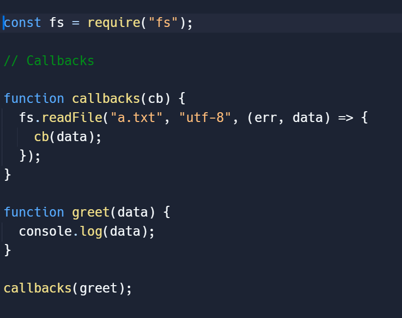
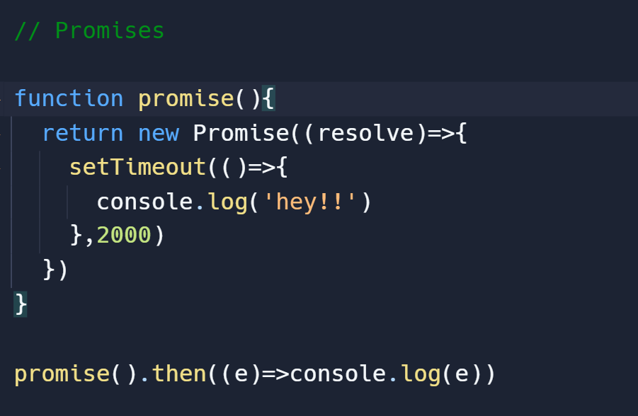
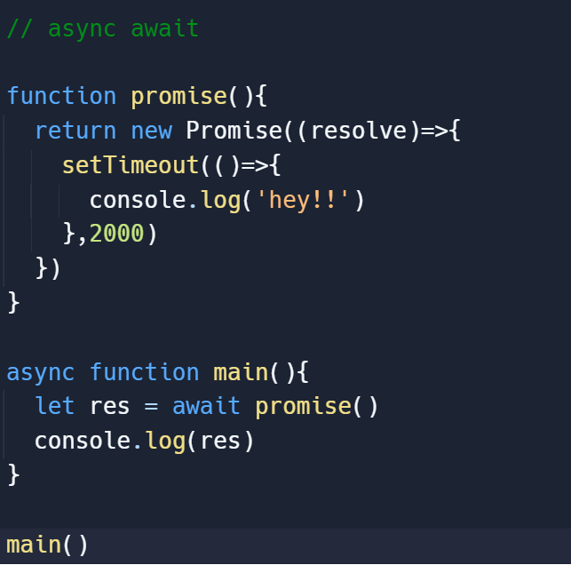

## Topics
1. Async vs Sync functions.
2. Real use of callbacks.
3. Promises.
4. Async await.

|Synchronous function |Asynchronous function |
|---|---|
|Synchronous - means Together,one after the other or sequential.|Multiple things are context switching with each other.

**Now lets see the examples of Synchronous function and Asynchronous function**

*1. Synchronous function*
```
// Synchronous function that performs tasks sequentially

function synchronous() {
  console.log('sync 1');
  console.log('sync 2');
  console.log('sync 3');
}

// Calling the synchronous function
console.log('Synchronous Function:');
synchronous();
console.log('Next task after synchronous function');

```

**Output :**
```
Synchronous Operation:
sync 1
sync 2
sync 3
Next task after synchronous function

```
*2. Asynchronous function*


```
// Asynchronous function using a callback

function asynchronousOperation(callback) {
  setTimeout(function() {
    callback('Asynchronous task completed!');
  }, 2000); // Simulating a delay of 2 seconds
}

// Callback function to handle the result

function handleAsyncResult(result) {
  console.log('Asynchronous Operation:');
  console.log(result);
  console.log('Next task after asynchronous operation');
}

// Calling the asynchronous function with a callback
asynchronousOperation(handleAsyncResult);

```
**Output :**

```
// After approximately 2 seconds delay:

Asynchronous Operation:
Asynchronous task completed!
Next task after asynchronous operation

```


#### Can Js delegate? Can Js context switch? 
*Yes! By Using async functions*

- By observing the above examples we can conclude that :
Even though Javascript is single threaded, they can do parallel things by delegatting works.
-By context switching - Net amount of time to do any particular task can be decresed.

#### What are the common async functions
- setTimeout
- fs.readFile-(to read a file from your fileSystem)
- fetch -(to fetch some data from API endpoint.)

### The Real Use of Callback functions
- We use callback functions more in async functions like:
1.Fetching Data from an API
2.Event Handling
3.Iteration and Control Flow
4.Reading Files Asynchronously(in node.js)

#### To Understand the javascript architecture and the nature of async functions:

- Write a async code and observe how the aync function works.

   [Vist the Website](http://latentflip.com/loupe/?code=JC5vbignYnV0dG9uJywgJ2NsaWNrJywgZnVuY3Rpb24gb25DbGljaygpIHsKICAgIHNldFRpbWVvdXQoZnVuY3Rpb24gdGltZXIoKSB7CiAgICAgICAgY29uc29sZS5sb2coJ1lvdSBjbGlja2VkIHRoZSBidXR0b24hJyk7ICAgIAogICAgfSwgMjAwMCk7Cn0pOwoKY29uc29sZS5sb2coIkhpISIpOwoKc2V0VGltZW91dChmdW5jdGlvbiB0aW1lb3V0KCkgewogICAgY29uc29sZS5sb2coIkNsaWNrIHRoZSBidXR0b24hIik7Cn0sIDUwMDApOwoKY29uc29sZS5sb2coIldlbGNvbWUgdG8gbG91cGUuIik7!!!PGJ1dHRvbj5DbGljayBtZSE8L2J1dHRvbj4%3D)


### Promises
- Promises in JavaScript are a way to handle asynchronous operations. 
- It is just a syntactic sugar which makes callback and async functions slightly more readable.
- Still uses callback  under the hood 

```
// Creating a new Promise
const fs = require('fs') //fs- File System

// Create a file with the txt extention and store some data/information in that file

function Promise(){
  return Promise((resolve)=>{
    fs.readFile('filename.txt','utf-8',(err,data)=>{
      resolve(data)
    })
  })
}
function ondone(data){
  console.log(data)
}

Promise().then(ondone)


```


### Async Await 
- It is also a syntatic sugar. Still uses callback / Promises under the hood .
- Makes code much more readable than callbacks / Promises.

```
// Example of an asynchronous function using async/await
async function myAsyncFunction() {
 
  let p = new Promise((resolved)=>{
    // async logic
    setTimeout(() => {
      resolve('Async operation complete!');
    }, 2000);
  })
  return p;
}
async function main(){
    let value= await myAsyncFunction();
    console.log(value)
}
main()
```

|Callback|Promise|Async_await|
|----|---|----|
||||
||||
|||

