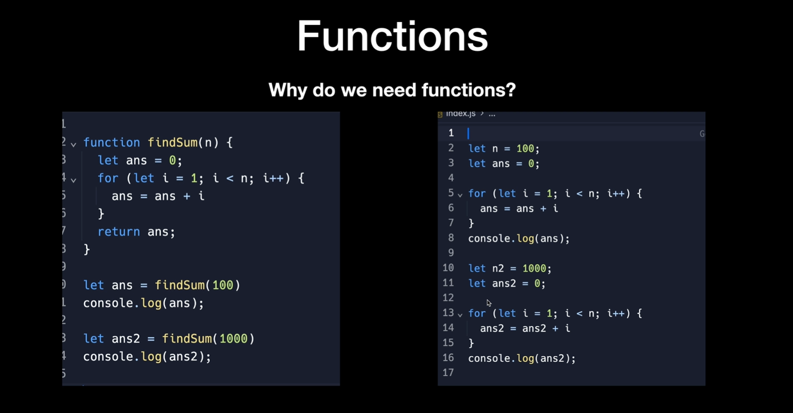
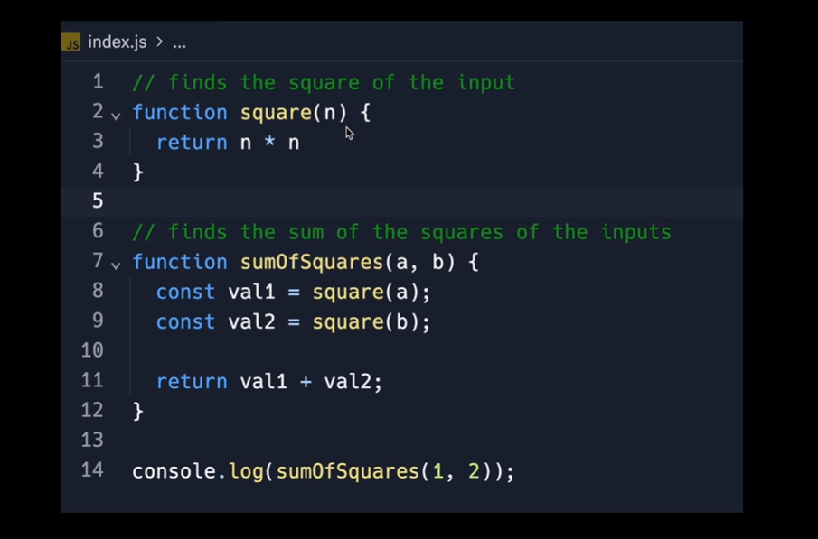
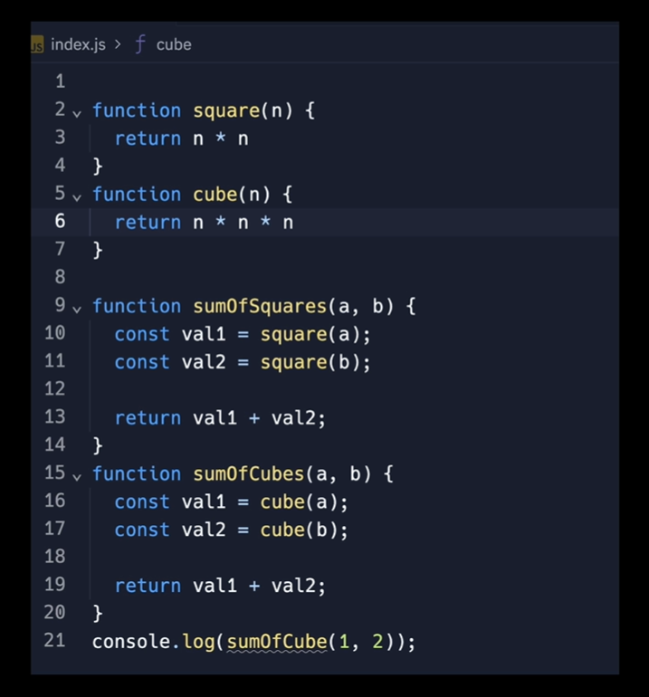
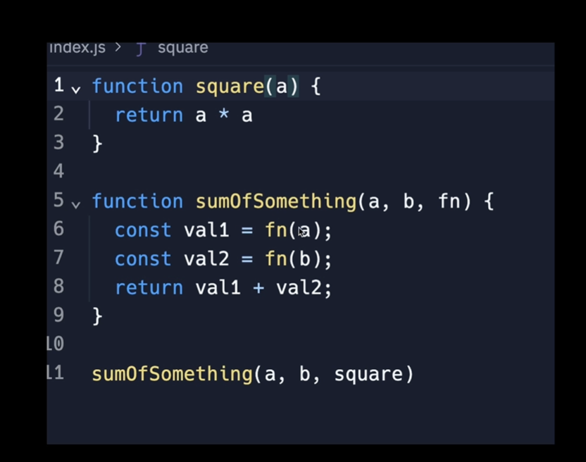

## Topics

- Loops
- Function
- callback

### Loops

```
// calculate the sum  from 0 to 50

1. Dumb way

let sum = 1+2+3+4+5+6+7+8+9+10+ 
          11+12+13+14+15+16+17+18+19+20+
          21+22+23+24+25+26+27+28+29+30+
          31+32+33+34+35+36+37+38+39+40+
          41+42+43+44+45+46+47+48+49+50 

console.log(sum)

The flaws of above  code:
1. Too much text
2. what if u need to calculate the sum  from 0 to 500 , u need to write alot of code to achieve this

```

```

2. Using loops

let sum = 0

for(let i=0;i<=50;i++){
  sum = sum + i
}
console.log(sum)

The advantage of loops:

1. Reduce the code repetation
2. Easy to debug

```

#### Syntax of For loop

```
for (initialization; condition; update) 
{
//  Code to be repeated
}

How loops works
1. First loops goes to initalization step.
2. And then it checks the condition statement.
if the condition if true, then it execute the block of code.
or else  it exist the loop.
3. After exectuing the block of code it goes to updation step where the values can be incremented or it can be decremented.
4. Then again controls check the condition and exectute the block of code
This is will be done again and again until the condition fails

```

- You can even visualize how actually the code runs.
 [Vist the Website](http://latentflip.com/loupe/?code=JC5vbignYnV0dG9uJywgJ2NsaWNrJywgZnVuY3Rpb24gb25DbGljaygpIHsKICAgIHNldFRpbWVvdXQoZnVuY3Rpb24gdGltZXIoKSB7CiAgICAgICAgY29uc29sZS5sb2coJ1lvdSBjbGlja2VkIHRoZSBidXR0b24hJyk7ICAgIAogICAgfSwgMjAwMCk7Cn0pOwoKY29uc29sZS5sb2coIkhpISIpOwoKc2V0VGltZW91dChmdW5jdGlvbiB0aW1lb3V0KCkgewogICAgY29uc29sZS5sb2coIkNsaWNrIHRoZSBidXR0b24hIik7Cn0sIDUwMDApOwoKY29uc29sZS5sb2coIldlbGNvbWUgdG8gbG91cGUuIik7!!!PGJ1dHRvbj5DbGljayBtZSE8L2J1dHRvbj4%3D)
 - This webiste let you visualize how code is running

### Function
- A function is a set of statements that perform a task or caluculate a value.
It should take some value and return the output where there is  some obvious relationship between the input and output

#### Syntax of Function.
```
function FunctionName(parameters) 
{
    // Code to be executed
}
FunctionName(arguments) // Function call
```
- A Function can take more than one arguments in order to perform the specific assigned task



In the above image u can see the difference of using the function, it orgainize our code and helps us to manage our code  

#### Advantages of Function
1. Code Reusability

2. Modularity : Functions allow you to break down your code into smaller, manageable, and reusable pieces.

3. Parameterization : 
Functions can accept parameters, enabling you to create flexible and customizable code.

4. Reduce the code length and can exectute the same logic multiple times


### CallBack Functions
- The  function can be called inside the another function

Example:


In above example we can see that a function sumOfSquares calling the function square inside its function.

Let's see the another example


The above ex is the extension of first example with cube funtion as extra

When u observe carefully u can see both sumOfSquares and sumOfCubes function are doing the same work

As the programmer our work is to make the code to simpler and easy to understand

The Solution is:


In above example we can see a function is taking the three arguments 
An arguments can be string,number,Boolean,and can be also a function

Here it takes a function square as a callback funtion to exectute the specfic mentioned code.

#### Anonymous Function
- A function that does not have a name.

```
// An anonymous function assigned to a variable

let greet = function(name) {
  console.log(`Hello, ${name}!`);
};

// Calling the anonymous function
greet('Alice'); // Output: Hello, Alice!

```