## Intro

1. What is Git??
- It is a Free Source version control System.

What is version control System.
- 
* A system that keeps track of our files or projects.
* It allow you to revert selected files to a previous state,revert the entire project to a previous state, compare changes over time ,see who last modifided something so that we can know what might be causing a problem,or what is the issue, who made it , and when with the details.

>  What if we don't have version control System feature, then we need to make the many version of one projects like in below image.

> It would made really difficult to manage a projects effectively.

> Its helps in maintaining the big projects.


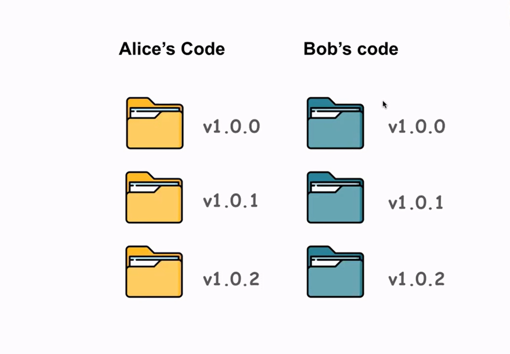


#### Two types of version control System.

1. Centralized
2. Distributed

### Centralized : 
As the name suggest , there is a centralized server which is actually used to access the code and at the same time make any change in the code

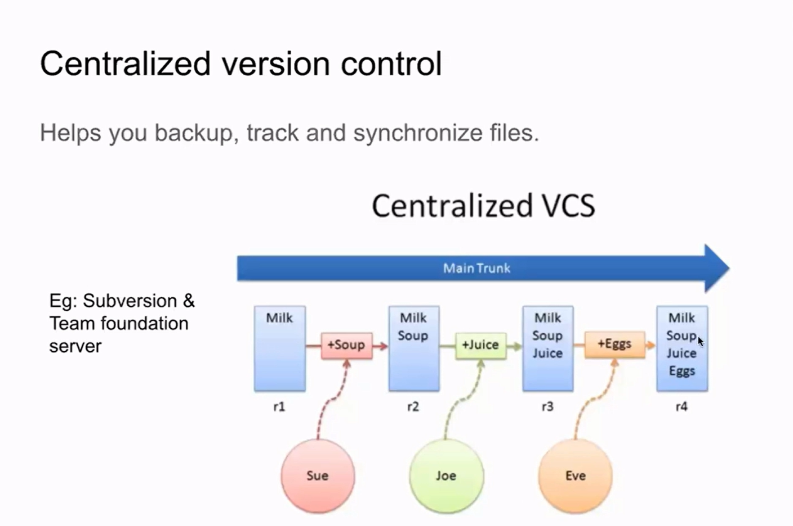

* The group of people who are working under the same project can get the current project from the main track i.e(centralized vcs)

* They can even push the change they made in their code to the main project

* This is only good for small projects 
* The disadvatange of this system is as the size of the codebase and the number of developers increase, the performance of a Centralized vcs can degrade. Operations like checkouts and updates may become slower due to the need to communicate with the central server for every action.
* It requires a constant network connection to the central server. 

### Distributed :
 This is very useful tecqunique when  ur dealing with big projects .

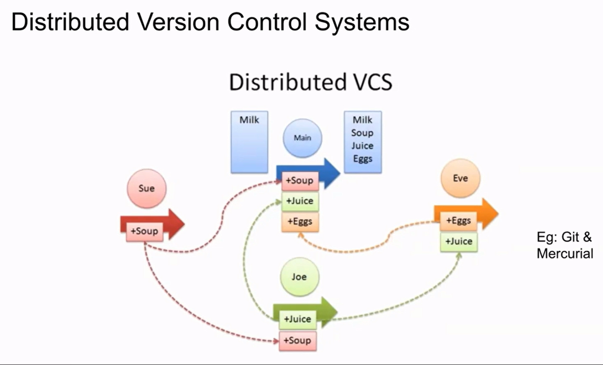 

* In a DVCS, each developer has a complete copy of the repository on their local machine.

* Developers can work on their local copies of the repository even when not connected to a network. 

* Network connection is only required when the contributer needs to publish their code or sync the updates.

Ex : Git and Mercuria

 Why Git ??
-

* Its Free
* It is open source
* It is a scalabe - because u don't need a active server to serve this request,   Developers can work on their local copies of the repository even when not connected to a network. 
* It is Super fast
* Cheap branching and merging

What is Github ?
- 
* Github is a web-based hosting server for git repositories.
* You can use git without github but you cannot use github without git.

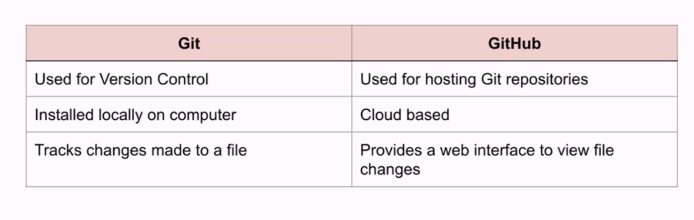

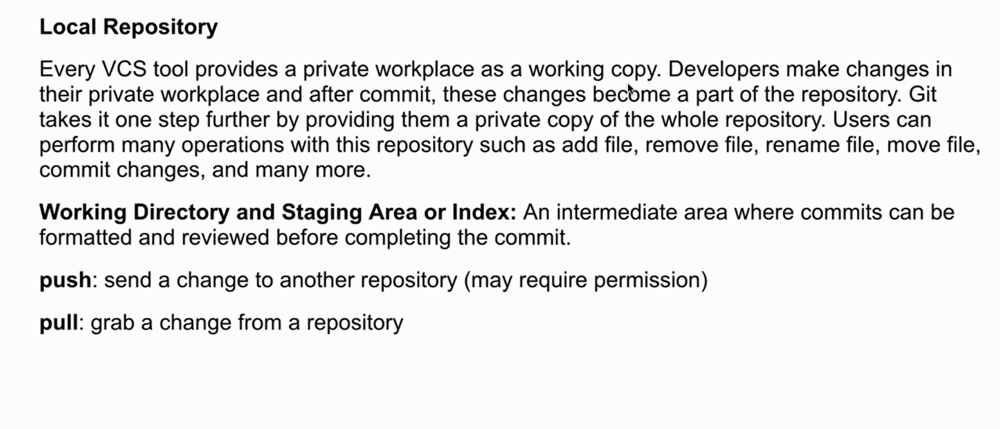

## Basic Workflow of Git
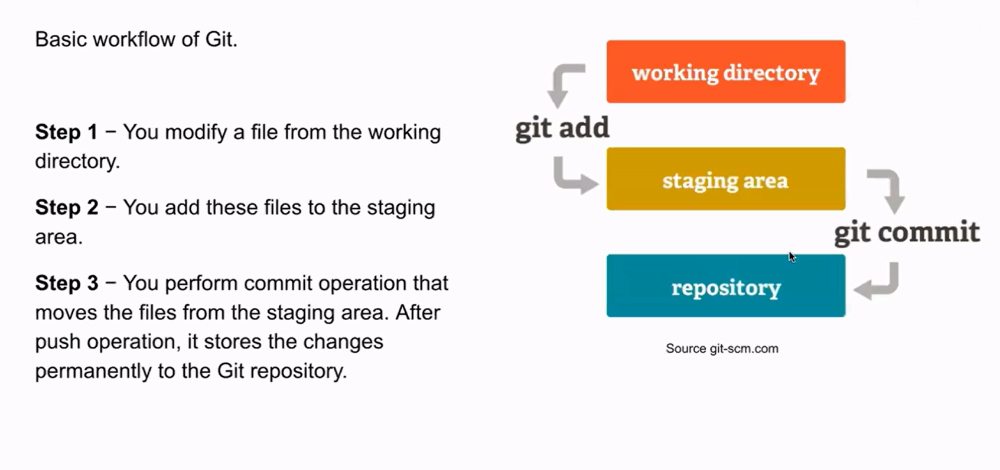

## Basic Terms
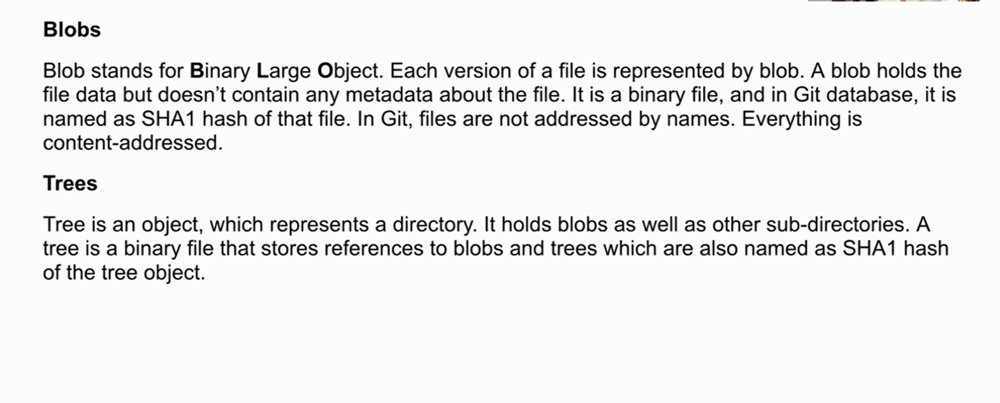
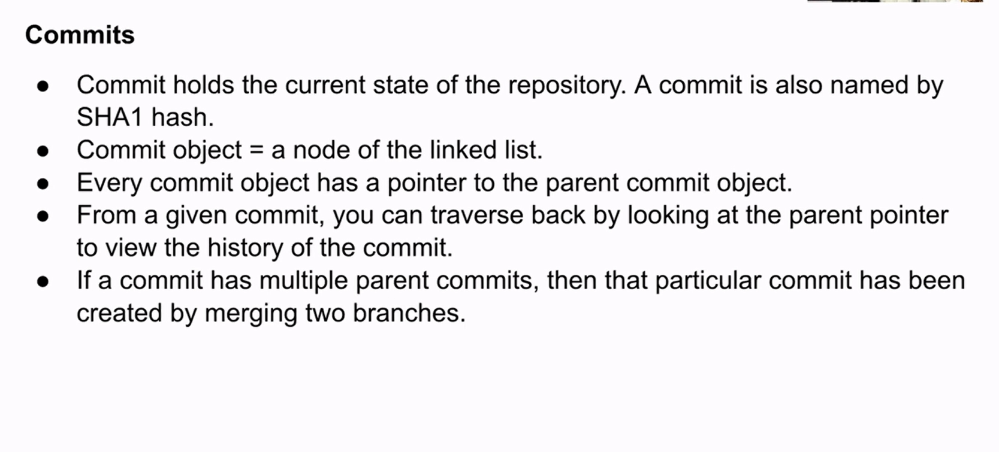

## GIT Commands
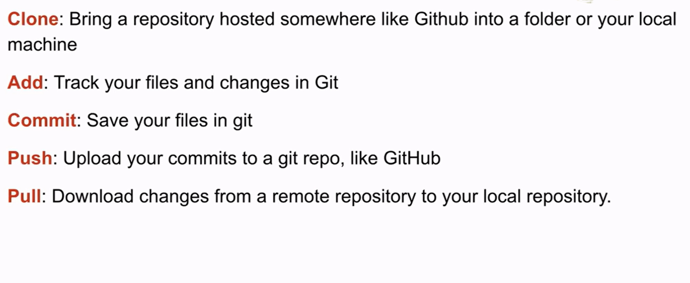

Assignement : 
1. Create a github account
2. Try to create a demo repository
3. Add / Create readme file, make some commits ,Try of exploring the github

After knowing how to use Github to create or add the files now lets see how we can add files from the command line(git)

1. Install Git locally
2. Config your username and email
```
git config --global user.name "Your Name"
git config --global user.email "your.email@example.com"

```
3. Imagine your are working on the new project, now u need create new repo under that project and push the code
* Open the git bash terminal
* Navigate throught the folder your working on, by using command ``` cd ``` i.e change directory
* Use command ``` git init ``` which help to create the new repo
* To check wheather it have created the repo use the command ``` ls -la``` , you will see the folder with the name git, which conform the creation of repo
* To know the current status of repo, use ``` git status ``` 
* To add all the file use ``` git add . ```
* If u want any of the added file  to remove / unstage the file use the command ``` git rm--cached <file> ```
* To commit use ``` git commit -m "Added" ```,
Always remember to add message at the end of commit because it define the each commit u make, it is very helpful for other know what changes are made 
* The git remote command is used in Git to manage connections to remote repositories.
* Use the ``` git remote -v ``` , if it doesn't show any thing, it means there is no repository is configure us to push the changes from local to remote repo
* ``` git remote add origin <link_of _repo>.git```.   
This command establishes a connection between your local repository and the remote repository.
* To push the code use ``` git push origin master``` .Here orgin is where the current repository is located and master is branch.
* Now if u go back to ur github repository and refresh u can see files u have added

#### How to have the copy of the project
* When Your working on some project, u need the duplicate copy of that project , so how will u get that.
We can clone the project into our local machine by using the command ``` git clone <remote url of the repo>```. 
* After having project locally on ur machine, u can add, remove , or make any changes in that projects

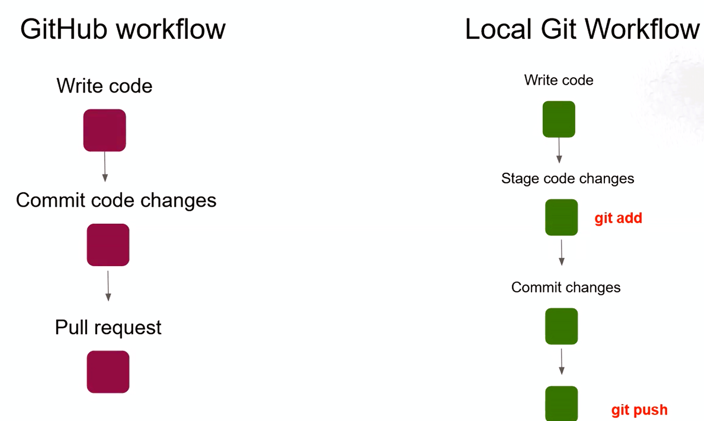

### Branching
Branching is a powerful feature that allows developers to create separate lines of development within a repository. Each branch represents an independent line of work, making it possible to work on different features, bug fixes, or experiments without affecting the main codebase. The main branch in Git is typically called "master," but it can also be named "main" or another term based on your project's conventions.

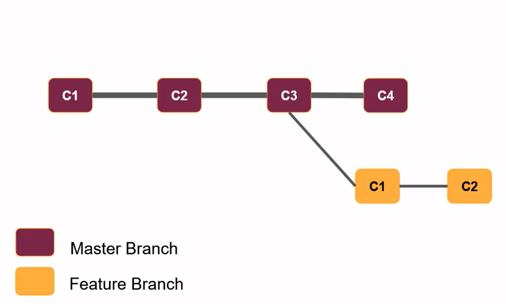

Let's Imagine your main project code is in Master Branch and U need to implement some features in ur projects but before directly include that feature u want to check that features and see wheather it works or not, in this time u can create a new Branch called Feature Branch , The commits in Feature Branch will not affect the Master branch.


After u feels like your features can be added to ur main project , then u can merge the feature branch to main branch.

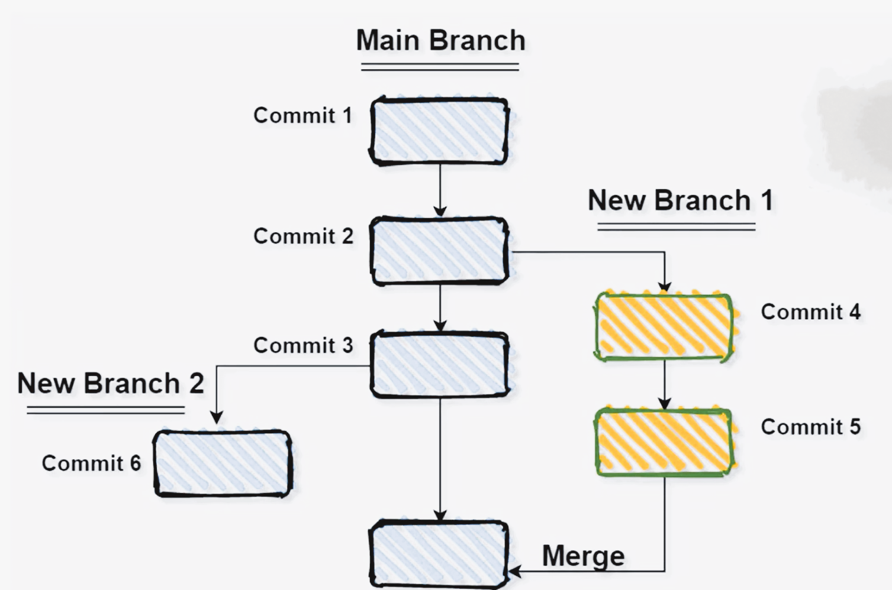

* We can create as many branch we want to create,which  helps to maintain a clean and organized history of your project's development.

### Creating the  new Branch

* To check currently which branch we are at use command ```git branch```
* Create a new branch ```git checkout -b <name of branch>```
* It will create new branch and switch to that new branch
* We can switch the branch by using the command ``` git checkout <branch_name> ```
* U can add the files in the new created branch and u can check the status of it . 
* Changes that  made in new branch will not reflect in main branch until it is merged to main branch
* ```git diff <branch_name>``` This command mainly provide the differnce between the main and the new branch, it can be incase of insertion/ delection of file
* To merge the new branch to main branch, first we need to do pull request to main branch
* After accepting the merge request , the changes in new branch will be reflection on the main branch
* In Git, the ```git commit -am``` command is a shorthand for combining the git add and git commit commands. 

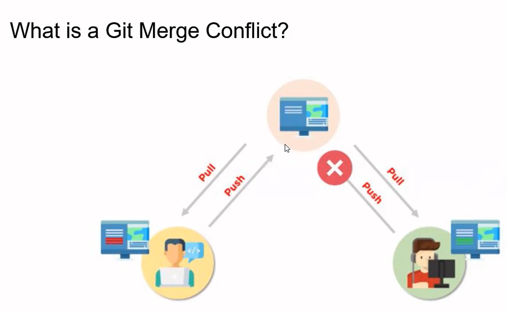

* A merge conflict in Git occurs when you attempt to merge two branches, and Git is unable to automatically reconcile the changes because there are conflicting modifications in the same part of a file on both branches.

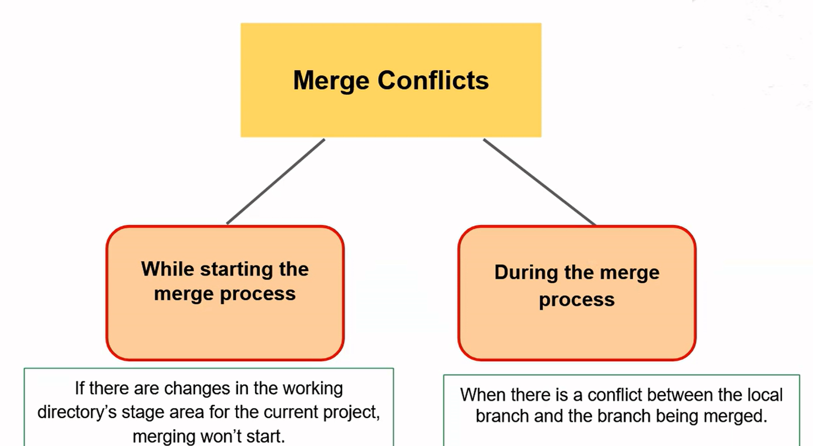

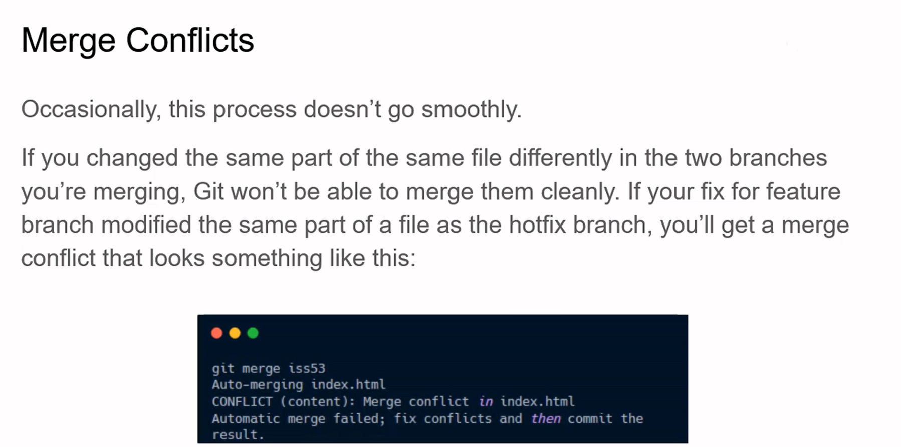

* If there is the change in same part of same file differenty in two branches that we are merging, then git conflits occus, to clear this u need to go into that particular file and can fix the problem

### Issues in Git
* It allow you to collobrate,track changes,communicate what need to be done in the repostries more effectively,can rise the issue about the project. And action can also be taken for these issues

1. Click on Issue tab  

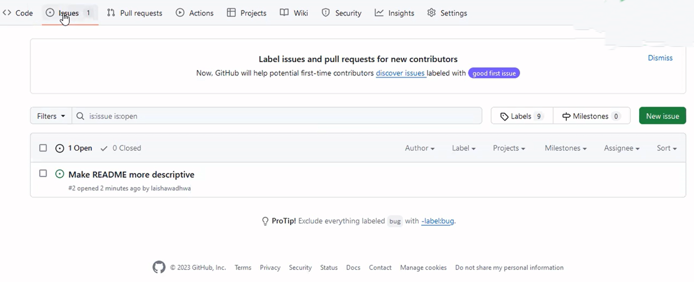

2. Click on new Issue 

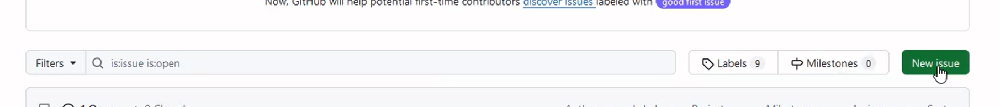

3. Add the issue title and explain issue briefly and submit.

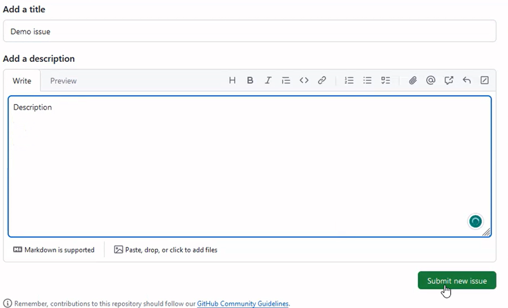